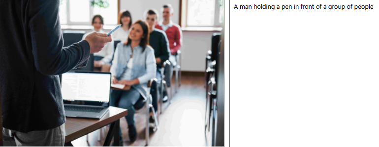

**Descrição**
O laboratório de **Visão Computacional na Azure** é um ambiente especializado para o desenvolvimento, treinamento e implementação de modelos de inteligência artificial focados em tarefas de visão computacional, como reconhecimento de objetos, classificação de imagens, segmentação, detecção facial e análise de vídeos. Aproveitando os poderosos recursos de nuvem do Microsoft Azure, esse laboratório oferece uma infraestrutura escalável e de alto desempenho, permitindo a realização de projetos de visão computacional de maneira eficiente e colaborativa.

**Ferramenta de detecção de rostos**
**Exemplo 1**

nota-se que na face #5 (cameraman) foi detectado como utilizando máscara e na face #8 (Rapaz atrás da bandeira de escanteio) detecta um objeto na frente do rosto a ser detectado.

**Exemplo 2**

nesse exemplo o rosto dos 3 jogadores foram detectados com êxito

**Exemplo 3**

Nesse exemplo, podemos notar que a detecção facial dos jogadores próximos foi bem sucedida, porém um rapaz mais ao fundo da imagem não tem sua face detectada devido ao desfoque.

**Análise de Documentos**

**Exemplo 1**

Conseguiu detectar perfeitamente os dados da etiqueta de postagem, inclusive a assinatura de recebimento.

**Exemplo 2**

Conseguiu extrair com uma moderada precisão as anotações do meu caderno, inclusive conseguiu extrair dados de uma nota fiscal que estava próxima.

**Exemplo 3**

Conseguiu extrair perfeitamente as informações da embalagem de uma mercadoria.

**Ferramenta de legenda de imagens**

**Exemplo 1**

Legenda bem sucedida

**Exemplo 2**

Legenda bem sucedida

**Exemplo 3**

Legenda bem sucedida